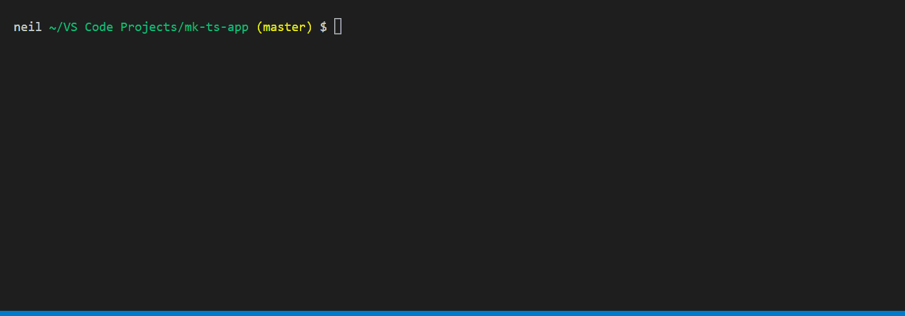

# **mk-ts-app**
Streamline your Typescript/Node project set up with mk-ts-app. An interactive command line app will walk you through a complete set up in seconds!


## Features
`mk-ts-app` will do the following:
- Pick a package manager (yarn | npm)
- Create the main project directory
- Generate and add README & CHANGELOG 
- Pick and add a license file to the project
- Create a full package.json file
- Install [dependencies](#common-dependencies-installed)
- Add tsconfig.json file
- Add and configure eslint for TypeScript
- Add src/index.ts
- Optionally add Jest support
- Optionally add TypeDoc support

## Usage
Since this is a one time set up script installation is not needed. Instead run using `npx` in the desired directory
```
npx mk-ts-app
```
That's it! The script will walk you through the rest.

## Example Project Creation
Here's a quick example of the script being run:



<hr/>

## Common Dependencies Installed:
The following dependencies are always installed:
- `typescript`
- `@types/node`
- `eslint`
    - `@typescript-eslint/parser`
    - `@typescript-eslint/eslint-plugin`
- `ts-node`
- `tsc-watch`

## Optional Dependencies:
The following optional dependencies are installed based on user input:
- `jest`
    - `@types/jest`
    - `ts-jest`
- `TypeDoc`

## License
This project is licensed under the MIT License - see the <a href="/LICENSE.md">LICENSE.md</a> file for details